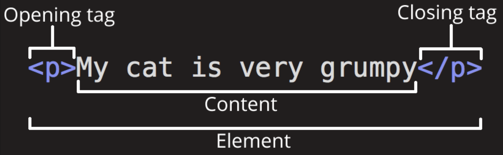
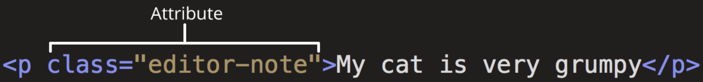
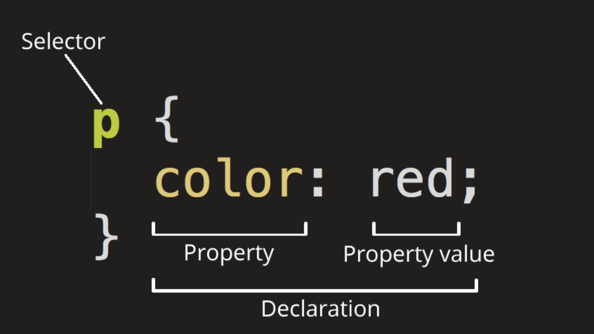
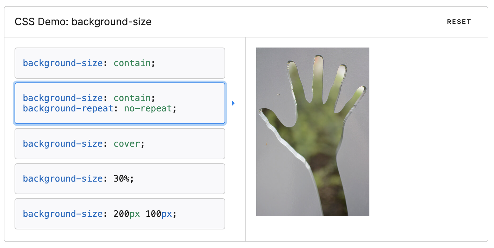
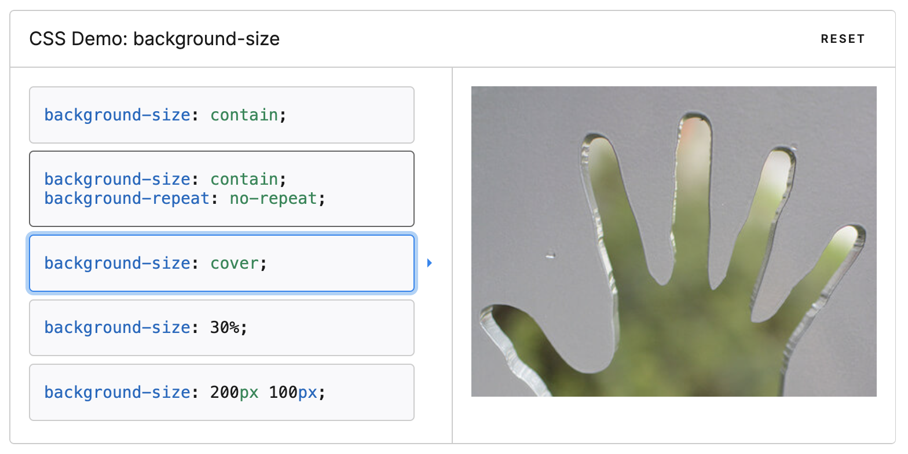

# BASIC THEORY:

## Connect files (index, style, main)

Create a folder with:

- index.html
- style.css
- main.js

Add this HTML template into the HTML file

```html
<!DOCTYPE html>
<html lang="en">
  <head>
    <meta charset="UTF-8" />
    <meta name="viewport" content="width=device-width, initial-scale=1.0" />
    <!-- JS link will go here-->
    <!-- CSS link will go here -->
    <title>Document</title>
  </head>
  <body></body>
</html>
```

To link CSS file to the HTML file add this line above the title tag

```html
<link rel="stylesheet" href="./style.css" />
```

To link JS file to the HTML file add this line above the CSS link

```html
<script defer src="./main.js"></script>
```

<details open>
  <summary>See the end result:</summary>

```html
<!DOCTYPE html>
<html lang="en">
  <head>
    <meta charset="UTF-8" />
    <meta name="viewport" content="width=device-width, initial-scale=1.0" />
    <script defer src="./main.js"></script>
    <link rel="stylesheet" href="./style.css" />
    <title>Document</title>
  </head>

  <body></body>
</html>
```

</details>

## Basic HTML

HTML (HyperText Markup Language) is a markup language that tells web browsers how to structure the web pages you visit.

The HTML element is the opening tag, followed by content, followed by the closing tag.



Elements can be placed within other elements. This is called nesting.

```html
<p>My cat is very grumpy</p>

<p>My cat is <strong>very</strong> grumpy.</p>

<!-- THIS IS WRONG -->
<p>My cat is <strong>very grumpy.</p></strong>
```

The tags <b>have to open and close in a way that they are inside or outside one another</b>.

```html
<!-- THIS IS WRONG -->
<p>My cat is <strong>very grumpy.</p></strong>
```

### Class vs ID

Elements can also have attributes. Attributes look like this:



Attributes contain extra information about the element that won't appear in the content.

- ID <b>must be unique</b>. Multiple HTML elements with the same ID are not allowed.
- Class can be assigned to multiple elements.
  It's helpful when we want to add the same styling to multiple elements.

### Inline vs block

A block-level element always takes up the full width available and always starts on a new line.
Two commonly used block elements are: `<p>` and `<div>`.

An inline element only takes up as much width as necessary and does not start on a new line.

Some of inline elements are: `img`, `<a>`, `<button>`, `<span>`

## Basic CSS

CSS (Cascading Style Sheets) is the code that styles web content.
Like HTML, CSS is not a programming language.
CSS is what you use to selectively style HTML elements.



- Selector is an HTML element name at the start of the ruleset. It defines the element(s) to be styled (in this example, `<p>` elements)

- Declaration is a single rule like `color: red;`. It specifies which of the element's properties you want to style.

- Properties are ways in which you can style an HTML element. (In this example, color is a property of the `<p>` elements.) In CSS, you choose which properties you want to affect in the rule.

- Property value chooses one out of many possible appearances for a given property. (For example, there are many color values in addition to `red`.)

### px vs v-units vs %

- The pixel unit (px) is an absolute unit to set the width. It is always the same regardless the screen size.

- A percentage unit (%) is based on its parent size.
  If a parent width is set to 57px and element's width is set to 20% then it will be 20% of 57px.

- Viewport units (vw/vh) are relative to 1% of the viewport.
  100vw is equal to 100% width of the viewport.
  100vh is equal to 100% height of the viewport

### absolute position

Absolute positioned elements are removed from the normal flow, and can overlap elements. The element is positioned relative to its closest positioned ancestor.

Absolutely positioned elements will ignore it's neighbors.

Default position of elements in browser is `static`

Elements are centered on the page:


Each element respect it's neighbor.

Now, there are the same 2 elements but the black one has position `absolute`.


Red element doesn't "see" the black element. Red thinks it's the only one and goes exactly to the center of the page.

Black element "ignores" the red one. It also behaves as if it's the only one element on the page, and also goes to the center.

### image cover vs contain

- `contain`

The image keeps its aspect ratio, but is resized to fit within the given dimension.



- `cover`

The image keeps its aspect ratio and fills the given dimension. The image will be clipped to fit.


